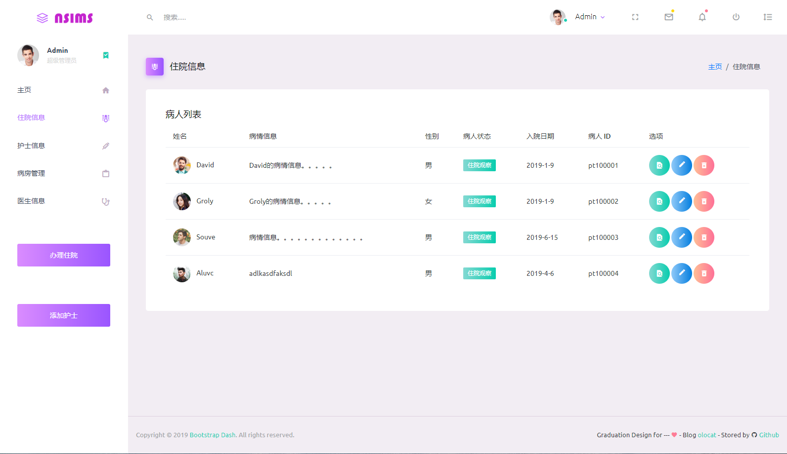
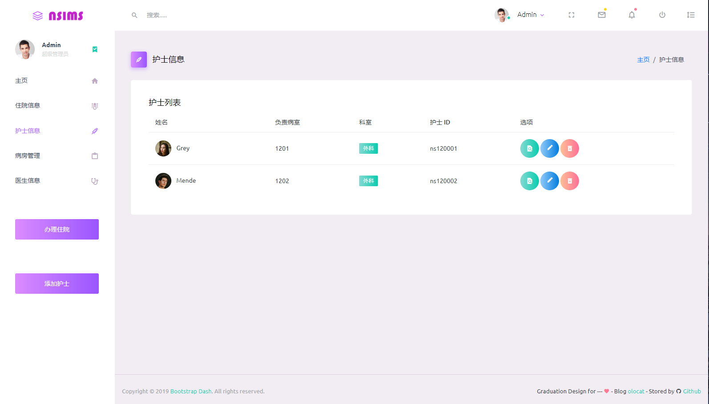
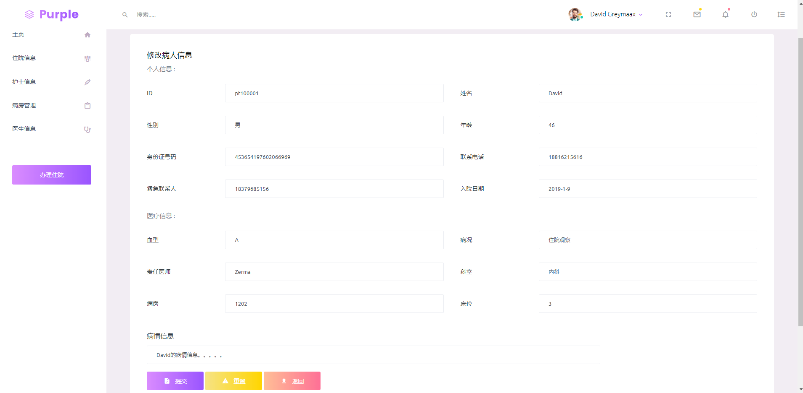

   
# :hospital: 护士站管理系统
### 前言：
 :bookmark_tabs: 毕业设计，竟然让做护士站管理系统。讲真，以前从未听说过。这个课题也是真心的有点醉。 :expressionless: :expressionless:   
简单说一下自己的思路，护士站管理系统的话，应该说是护士在护士台所使用的系统。用这个系统主要是对病人进行管理，
方便护士快速查找和管理病人信息。这大概是我的理解  
主要模块就是病人管理了。
---
### :date:创建日期：2019/8/7  
### :pencil2:项目作者：olocat  
### :newspaper:作者博客：[www.ololcat.com](https://www.olocat.com)
  
## 开发工具

| 工具   | 版本或描述           |    
| ----- | -------------------- |    
| OS    | Windows 10           |    
| JDK   | 1.8                  |    
| IDE   | IntelliJ IDEA 2019.3 |    
| Maven | 3.3.1                |    
| MySQL | 8.0                  |                

## 所使用框架版本

| jar     | 版本或描述     |    
| ------- | ------------- |    
| Spring  | 5.1.9-RELEASE |
| Mybatis | 3.5.2         |    
| Junit   | 4.11          | 
| jstl    | 1.2           |    
| mysql   | 8.0.17        |
| c3p0    | 0.9.5.4       |

### 其它见 pom.xml

## 当前进度
正在紧张的code中。。。  
 
  
## 展示
### 病人管理界面

接下来准备添加分页功能
### 病房管理界面

病房界面还没有开始，暂无功能
### 办理住院界面

接下来会添加输入验证，然后会修改性别、血型为 select 标签，增加关于医生验证  
### 修改住院信息

页面和添加基本一致  
## 接下来
### 主页
主页准备添加一些数据总览的图表，用于显示本月的出入院人数之类的  
在添加些快速的人员信息展示等
### 人员管理界面
暂时人员的管理界面还没完成，将会继续处理
### 登录页面
登录页面会等主体差不多完成后在添加
