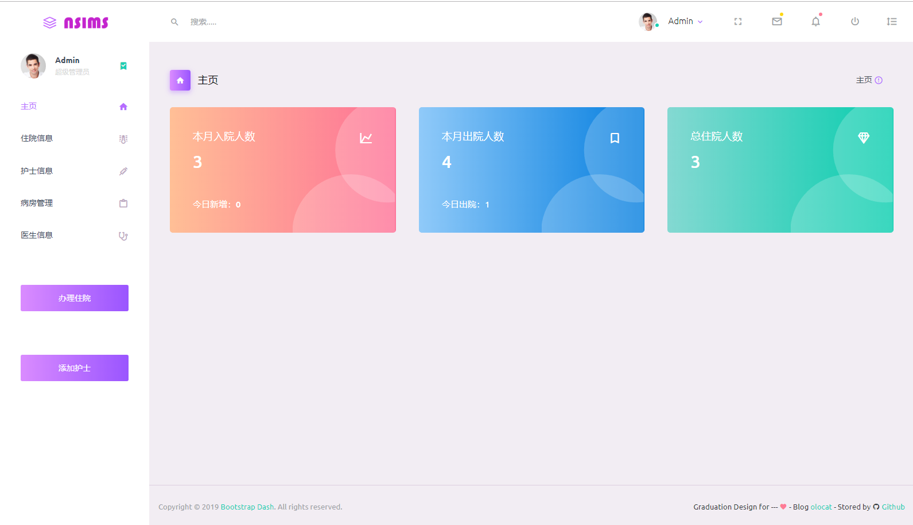

 
# :hospital: 护士站管理系统
### 前言：
 :bookmark_tabs: 毕业设计，竟然让做护士站管理系统。讲真，以前从未听说过。这个课题也是真心的有点醉。 :expressionless: :expressionless:   
简单说一下自己的思路，护士站管理系统的话，应该说是护士在护士台所使用的系统。用这个系统主要是对病人进行管理，
方便护士快速查找和管理病人信息。这大概是我的理解  
主要模块就是病人管理了。
---
### :date: 创建日期：2019/9/7  
### :pencil2: 项目作者：olocat  
### :newspaper: 作者博客：[www.ololcat.com](https://www.olocat.com)
### :memo: 前端框架：Bootstrap
### :book: 后端框架：Spring + SpringMVC + MyBatis = (SSM)
### :scissors: 前端工具：WebStorm 2019.2
### :hammer: 后端工具：IntelliJ IDEA 2019.2
### :triangular_ruler: 数据库工具：DataGrip 2019.2
## 开发工具

| 工具   | 版本或描述           |    
| ----- | -------------------- |    
| OS    | Windows 10           |    
| JDK   | 1.8                  |    
| IDE   | IntelliJ IDEA 2019.2 |    
| Maven | 3.3.1                |    
| MySQL | 8.0                  |                

## 所使用框架版本

| jar     | 版本或描述     |    
| ------- | ------------- |    
| Spring  | 5.1.9-RELEASE |
| Mybatis | 3.5.2         |    
| Junit   | 4.11          | 
| jstl    | 1.2           |    
| mysql   | 8.0.17        |
| c3p0    | 0.9.5.4       |

### 其它见 pom.xml

## 当前进度
正在紧张的code中。。。  
 
  
## :rainbow: 展示
### 主页

暂时为静态，准备添加此数据总览的功能
### 住院信息页面

基本完成增删改查，接下来会更新一下查看详细信息的界面（现在查看用的是修改页）
### 护士信息页面

基本完成增删改查，接下来会更新一下查看详细信息的界面（现在查看用的是修改页）
### 病房信息页面

也是静态页面，接下来会将其添加实际功能
### 办理住院信息页面

其实就是添加病人界面，其功能已经实现
### 添加护士信息页面

功能以基本实现
## :monorail: 接下来
### 主页
主页准备添加一些数据总览的图表，用于显示本月的出入院人数之类的  
在添加些快速的人员信息展示等
### 人员管理界面
暂时人员的管理界面还没完成，将会继续处理，包括表单验证，和字典对应。  
这俩项准备等主体完成后在进行  
表单验证就不用说了，准备会在性别，血型等处改为 select 标签 主治医生将添加字典对应  
还有病房，床位，部门，职位等都将会添加字典验证。
### 登录页面
登录页面会等主体差不多完成后在添加
